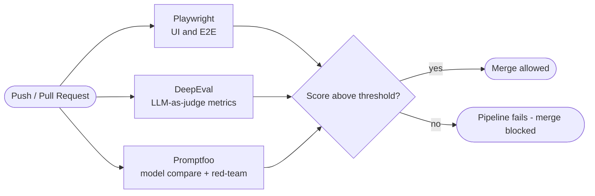

<h1 align="center">qa-eval-lab</h1>

<p align="center">
  <b>Ship AI features with confidence.</b><br/>
  Playwright UI tests <b>and</b> LLM evaluation (DeepEval · Promptfoo) wired into a single <b>CI eval-gate</b>.
</p>

<p align="center">
  
  
  
  
  
  
  
</p>

---

## 🎯 Why this repo

Most test suites verify **deterministic** software. AI features are different: the output can look *shaped* correctly yet be **wrong** — a **"false green"** that a `status == 200` or "field exists" assertion happily lets through.

`qa-eval-lab` treats model output like anything else under test:

- **Rubric-based verdicts** with an *LLM-as-judge* instead of brittle string matching.
- **Regression on prompts & models**, so a model/prompt change can't silently break behavior.
- **Red-teaming** for prompt injection, PII leakage and jailbreaks.
- A **CI eval-gate** that fails the pipeline — and blocks the merge — when quality drops below a threshold.

> Reference project for the transition **QA Automation → AI-Evaluation Engineer**. Traditional QA discipline (coverage, regression gates, failure-mode thinking) applied to non-deterministic LLM systems.

---

## 🧩 What's inside

| Layer | Tool | What it does |
|---|---|---|
| **UI / E2E** | Playwright + TypeScript | Cross-browser flows with the real **auth pattern** (`storageState`): log in once, reuse the session in every test. |
| **Model evals** | DeepEval (pytest-native) | `GEval` (LLM-as-judge), `AnswerRelevancy`, hallucination checks over a dataset. |
| **Prompt / security** | Promptfoo | Compare models, `llm-rubric` assertions, and **red-teaming** (injection, PII, jailbreak). |
| **Gate** | GitHub Actions | Runs UI + evals on every push/PR and **fails when the score drops**. |

---

## 🏗️ Architecture — the eval-gate



The gate is the point: **a model update that starts hallucinating or drifting fails CI before it ever reaches a user.**

---

## 🚀 Quickstart

**Prerequisites:** Node 18+, Python 3.10+, and an `OPENAI_API_KEY` (or another provider) for the LLM-as-judge.

```bash
# 1) Clone
git clone https://github.com/criguex/qa-eval-lab.git && cd qa-eval-lab

# 2) UI tests (Playwright)
npm install
npx playwright install chromium
npm run test:ui
#   real apps: do the login yourself once, session is saved
MANUAL_LOGIN=1 npx playwright test --project=setup --headed

# 3) LLM evals (need OPENAI_API_KEY)
export OPENAI_API_KEY=sk-...
pip install -r evals/requirements.txt
deepeval test run evals/test_support_eval.py     # realistic dataset (Module 1)
npm run eval:promptfoo                            # model compare + rubric
npx promptfoo@latest redteam run                  # security / red-team
```

---

## 🟢 The "false green" in action

`evals/dataset.jsonl` powers `evals/test_support_eval.py` (a fintech support assistant). **Two rows carry answers that are well-formed but factually wrong** on purpose:

| Case | Question | Wrong answer under test | Why the judge must fail it |
|---|---|---|---|
| `dispute-window` | Dispute a 90-day-old charge? | "Yes, any charge, no time limit." | Ignores the ~60-day window. |
| `card-blocked` | Card blocked after 3 wrong PINs | "Permanently cancelled, unrecoverable." | Invents an irreversible outcome. |

A naive assertion passes them (they *look* right). The **LLM-as-judge fails them** — that's the false green the gate is built to catch.

---

## 📏 How verdicts are made

| Metric | Question it answers | Threshold |
|---|---|---|
| `GEval` (Correctness) | Is the answer factually right vs the expected output? | `0.7` |
| `AnswerRelevancy` | Does the answer actually address the question? | `0.7` |
| Promptfoo `llm-rubric` | Does the output meet a written rubric? | rubric-based |
| Promptfoo `redteam` | Does it resist injection / PII / jailbreak? | attack-based |

Deterministic where the spec allows it, scored against acceptance criteria where it doesn't.

---

## 📂 Project structure

```
qa-eval-lab/
├─ tests/
│  ├─ auth.setup.ts        # login-once → storageState (the login you do)
│  └─ ui/example.spec.ts   # E2E reusing the authenticated session
├─ evals/
│  ├─ dataset.jsonl        # realistic fintech-support cases (2 are false greens)
│  ├─ test_support_eval.py # Module 1 — LLM-as-judge over the dataset
│  ├─ test_llm_eval.py     # minimal GEval + relevancy example
│  ├─ promptfooconfig.yaml # model compare + rubric + red-team
│  └─ requirements.txt
├─ .github/workflows/
│  └─ eval-gate.yml        # UI + evals as a CI gate
├─ playwright.config.ts
└─ package.json
```

---

## 🧠 Skills demonstrated

`Playwright` · `TypeScript` · `Python` · `LLM-as-judge` · `DeepEval` · `Promptfoo` · `RAG/agent eval mindset` · `red-teaming (OWASP LLM Top 10)` · `CI/CD quality gates` · `GitHub Actions`

---

## 🗺️ Roadmap

- [x] **Module 1** — realistic dataset + LLM-as-judge (this repo)
- [ ] **Module 2** — RAG evaluation (context precision/recall with RAGAS)
- [ ] **Module 3** — agent / trajectory evaluation (tool-use, task success)
- [ ] **Module 4** — judge calibration report (human ↔ judge agreement)
- [ ] Observability layer (Arize Phoenix / Braintrust)

---

## 👤 Author

**Cristian Guerra** — Senior SDET · QA Automation · AI-Evaluation, from Medellín 🇨🇴 (US time zones).

[GitHub](https://github.com/criguex) · [LinkedIn](https://www.linkedin.com/in/criguex) · open to remote contract roles in QA automation, SDET and AI evaluation.

## 📄 License

MIT © Cristian Guerra — see [LICENSE](LICENSE).
